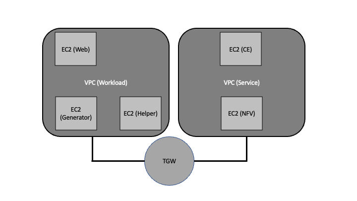
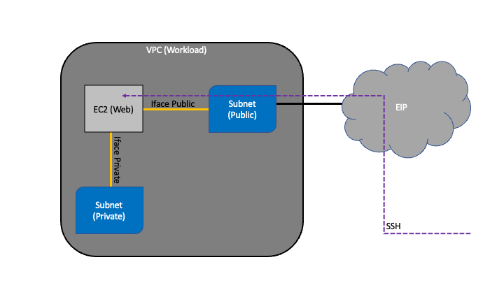
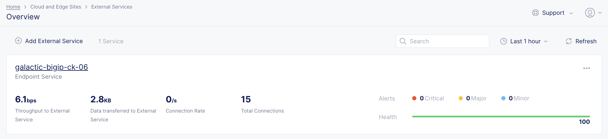
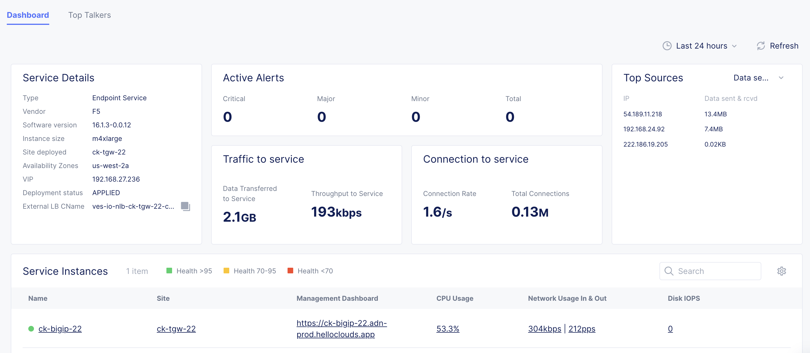
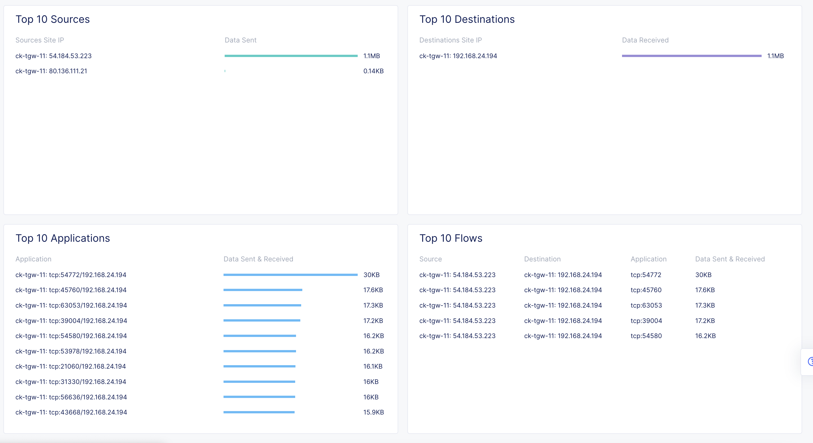
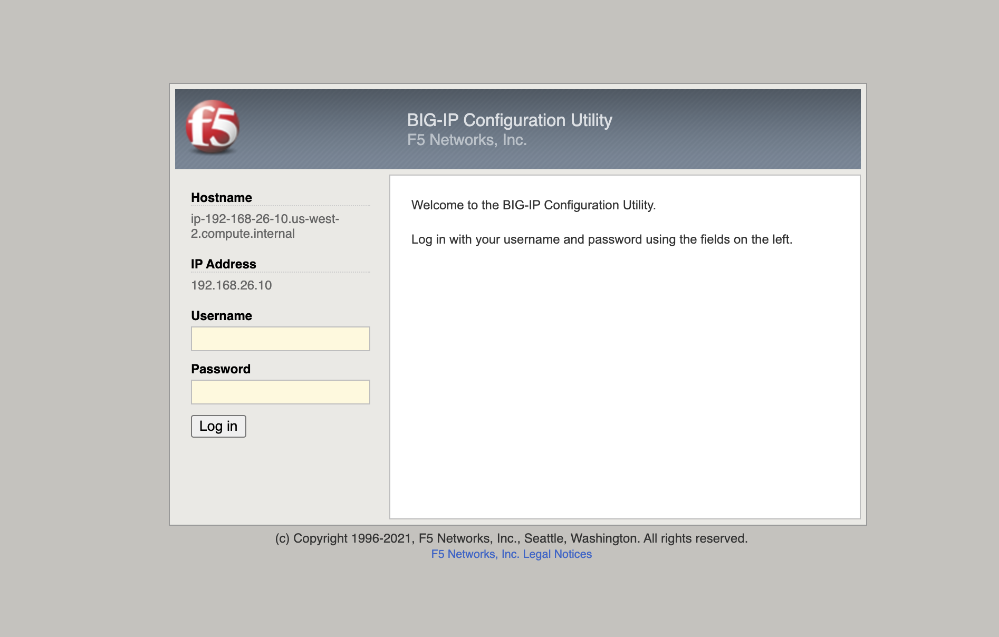

# Volterra NFV - External Service - BiGIP
This repository consists if Terraform modules to bring up End-to-End Volterra BigIP NFV aka External Service.
Approximately deployment time for this feature is between 45min and 1h30min.

## Table of Contents

- [Volterra NFV - External Service - BiGIP](#volterra-nfv---external-service---bigip)
  * [Table of Contents](#table-of-contents)
  * [Overview](#overview)
  * [Components](#components)
    + [EC2](#ec2)
    + [VPC](#vpc)
  * [Clone module repository](#clone-module-repository)
  * [Demo](#demo)
    + [Helper Instance](#helper-instance)
  * [Issues](#issues)

## Overview 
General overview of the structure of the environment.



## Components

Multiple components are used to spin up this end-to-end demo environment. 

### EC2

- CE: instance running Volterra Edge Router
- NFV: instance running BigIP 
- Web: instance running Nginx webserver
  
- Generator: instance running WAF specific traffic generator
- Helper: instance used during deployment and provides VNC sever to access TMUI through BigIP internal interface

### VPC

- Workload: Used by Web, Generator and Helper EC2 instances
- Service: Used by CE and NFV EC2 instances

## Clone module repository

- Clone this repo with: `git clone https://github.com/cklewar/f5-xc-aws-tgw--multinode`
- Enter repository directory with: `cd f5-xc-aws-tgw-multinode`
- Clone __modules__ repository with: `git clone https://github.com/cklewar/f5-xc-modules`
- Rename __modules__ repository directory name with: `mv f5-xc-modules modules`
- Obtain F5XC API certificate file from Console and save it to `cert` directory

## Demo

To demonstrate BigIP External Service login to F5XC console and navigate to __Cloud and Edge Sites --> External Services --> Overview__.
The overview gives details about existing NFVs and there actual status. 



Open the NFV Dashboard by clicking NFV name. 



Also view Top Talkers.



One could demonstrate access to BigIP TMUI. In dashboard view find __Service Instances__ table and click according link in __Management Dashboard__ column. 



Credentials: admin/<password>

### Helper Instance

- Find private key either in AWS console or in repository at `modules/ec2/keys`
- To access Gitea WebGUI setup SSH tunnel with: `ssh -i "key" -L 3000:localhost:3000 ubuntu@<the_host_name>.us-west-2.compute.amazonaws.com`
  - Acess from local web browser with URL: `http://localhost:3000`
- To access BigIP TMUI setup SSH tunnel with: `ssh -i "key" -L 8080:<BIG IP Internal Interface IP>:80 ubuntu@<the_host_name>.us-west-2.compute.amazonaws.com`
  - Access from local web browser with URL: `http://localhost:8080`

## Issues
- With AWS Provider version `4.14.0"` and Volterra provider version `0.11.9` sometimes below message seen after 10min waiting for TGW to be created. 

````bash
Error: error waiting for Load Balancer (RqxMfNfmu-outside) to be active: timeout while waiting for state to become 'active' (last state: 'provisioning', timeout: 10m0s)
│ 
│   on ../../../modules/views/ce-aws-lb/main.tf line 90, in resource "aws_lb" "elb-slo":
│   90: resource "aws_lb" "elb-slo" {
````

- Terraform BigIP Module needs to run separately, because provider tries to open connection immediately when plugin is loaded by Terraform main process    

- Volterra Terraform provider RT filter isn't accurate enough and returning multiple RT entries which leads Terraform exception
```bash
Error: error reading EC2 Transit Gateway Route Table: multiple results found, try adjusting search criteria

  on main.tf line 316, in data "aws_ec2_transit_gateway_route_table" "svcs_rt":
 316: data "aws_ec2_transit_gateway_route_table" "svcs_rt" {


Error: error reading EC2 Transit Gateway Route Table: multiple results found, try adjusting search criteria

  on main.tf line 329, in data "aws_ec2_transit_gateway_vpc_attachment" "svcs_vpc":
 329: data "aws_ec2_transit_gateway_vpc_attachment" "svcs_vpc" {
```